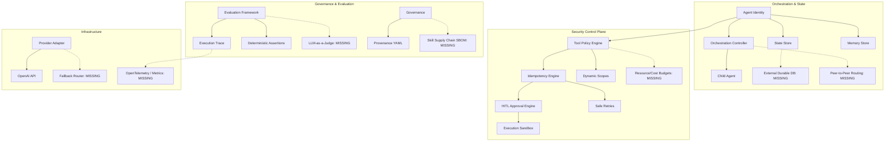

# V3 Capability Map

## Missing Edges & Nodes
- The Execution Trace is not connected to a standard Observability layer (e.g., OpenTelemetry, cost/latency tracking).
- The Orchestration Controller lacks horizontal routing (P2P / Blackboard) patterns.
- The Security Control Plane lacks Resource Budgets (token limits, API request rate limits per agent).
- The Provider Adapter lacks fallback routing and circuit breakers.
- The Evaluation Framework relies strictly on deterministic assertions and lacks behavioral scoring via LLM Judges.
- The Governance system lacks formal SBOM or cryptographic integrity checks for third-party skills.
